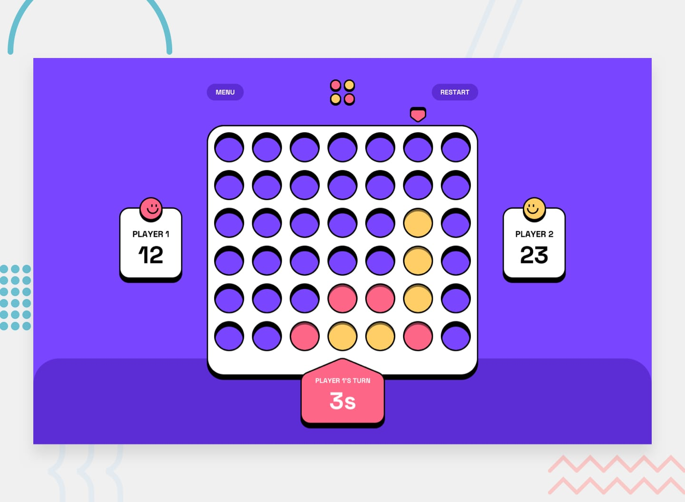

# Frontend Mentor - Connect Four Game Solution

This is a solution to the [Connect Four Game challenge on Frontend Mentor](https://www.frontendmentor.io/challenges/connect-four-game-6G8QVH923s). Frontend Mentor challenges help developers enhance their coding skills by building realistic, production-ready projects with professional Figma design specs.

## 🔗 Links

- **Live Site URL**: [https://pretty-connect-four-game.vercel.app](https://pretty-connect-four-game.vercel.app)
- **GitHub Repository**: [https://github.com/Eng-MohamedHosny/connect-four-game](https://github.com/Eng-MohamedHosny/connect-four-game)

---

## 📸 Preview



---

## ✨ Features

- 🎮 **Two-Player Local Game**: Play Connect Four against another human player, taking turns on the same device.
- 🤖 **Intelligent CPU Opponent (Bonus)**: Play against a smart AI powered by the **Minimax Algorithm** with Alpha-Beta pruning and heuristic line evaluation (immediate win detection, threat blocking, and center-control strategy).
- ⏱️ **Real-Time 30-Second Countdown**: Each player has 30 seconds per turn displayed on a custom-shaped SVG indicator. If time expires, the turn player forfeits and the opponent scores a victory.
- 🎯 **Pixel-Perfect Figma Implementation**: Precision-matched typography, exact margins, borders, shadows (`0px 10px 0px 0px #000000`), and color tokens extracted directly from Figma Dev Mode.
- 🔄 **Alternating First Turns**: Player 1 goes first in game 1; the starter of the previous game goes second on subsequent games as specified in the official game rules.
- 🏆 **Winning Highlight & Win Card**:
  - Highlights the 4 winning discs with a centered white circle ring.
  - Floating win result card with "PLAY AGAIN" button.
  - Dynamic bottom shelf background that transforms from Dark Purple (`#5C2DD5`) to Red (`#FD6687`) or Yellow (`#FFCE67`) based on the winner.
- 🎊 **Confetti Celebration**: Celebratory particle burst using `canvas-confetti` when a player wins.
- 🔊 **Procedural Web Audio**: Zero-asset, zero-latency sound effects synthesized using the Web Audio API for disc drops, victories, and button presses.
- 📱 **Fully Responsive Layout**: Custom layouts specifically designed for **Mobile** (375px), **Tablet** (768px), and **Desktop** (1440px).
- ⏸️ **In-Game Pause & Game Rules Modals**: Pause menu allows Continuing, Restarting, or Quitting to the Main Menu. Rules modal displays objectives and step-by-step instructions.

---

## 🛠️ Built With

- **[React 19](https://react.dev/)** - Modern UI library
- **[TypeScript](https://www.typescriptlang.org/)** - Type safety and maintainable architecture
- **[Tailwind CSS v4](https://tailwindcss.com/)** - Utility-first styling with custom theme tokens
- **[Vite](https://vitejs.dev/)** - Next-generation lightning-fast build tool
- **[Canvas Confetti](https://www.npmjs.com/package/canvas-confetti)** - Victory particle effects
- **Web Audio API** - Native browser audio synthesis

---

## 📐 Design Tokens & Specifications

| Element | Value |
| :--- | :--- |
| **Dark Purple (Main bg / shelf)** | `#5C2DD5` |
| **Purple (Board bg / cards)** | `#7945FF` |
| **Player 1 / Red** | `#FD6687` |
| **Player 2 / CPU / Yellow** | `#FFCE67` |
| **Card / Button Borders** | `3px solid #000000` |
| **Card Drop Shadows** | `0px 10px 0px 0px #000000` |
| **Hover State Shadows** | `0px 10px 0px 0px #5C2DD5` |
| **Typography** | `Space Grotesk` (Medium 500, Bold 700) |

---

## 🚀 Getting Started

To run this project locally on your machine:

### Prerequisites
- Node.js (v18 or higher recommended)
- npm or yarn

### Installation

1. Clone the repository:
   ```bash
   git clone https://github.com/Eng-MohamedHosny/connect-four-game.git
   cd connect-four-game
   ```

2. Install dependencies:
   ```bash
   npm install
   ```

3. Start the local development server:
   ```bash
   npm run dev
   ```

4. Build for production:
   ```bash
   npm run build
   ```

5. Preview the production build:
   ```bash
   npm run preview
   ```

---

## 📂 Project Architecture

```
connect-four-game/
├── public/
│   ├── assets/
│   │   ├── fonts/           # Space Grotesk font files
│   │   └── images/          # Board SVGs, counters, markers, avatars
│   └── favicon-32x32.png
├── src/
│   ├── components/
│   │   ├── Modals/
│   │   │   ├── GameRulesModal.tsx # Rules dialog with checkmark dismiss
│   │   │   └── PauseModal.tsx     # Pause dialog (Continue, Restart, Quit)
│   │   ├── Board.tsx         # Double SVG-layered board engine with drop animation
│   │   ├── BottomShelf.tsx   # Dynamic color-shifting bottom shelf
│   │   ├── ColumnMarker.tsx  # Interactive hovering column pointer
│   │   ├── Header.tsx        # In-game menu, logo, and restart actions
│   │   ├── MainMenu.tsx      # Main menu screen
│   │   ├── ScoreCard.tsx     # Responsive player score card with overlapping avatars
│   │   └── TurnIndicator.tsx # Custom polygon turn timer or win result badge
│   ├── hooks/
│   │   └── useConnectFour.ts # Game state machine, 30s timer, score tracking
│   ├── utils/
│   │   ├── ai.ts             # Minimax algorithm with alpha-beta pruning
│   │   ├── audio.ts          # Web Audio sound synthesis
│   │   └── gameLogic.ts      # Win detection and board matrix operations
│   ├── constants.ts          # Game dimensions, limits, colors, and asset paths
│   ├── types.ts              # Core TypeScript interfaces and unions
│   ├── App.tsx               # Top-level screen coordinator
│   ├── index.css             # Tailwind v4 theme tokens and animations
│   └── main.tsx              # Application entry point
├── index.html
├── package.json
├── tsconfig.json
└── vite.config.ts
```

---

## 👨‍💻 Author

- **Mohamed Hosny** - [GitHub Profile](https://github.com/Eng-MohamedHosny)
- **Frontend Mentor** - [@Eng-MohamedHosny](https://www.frontendmentor.io/profile/Eng-MohamedHosny)
